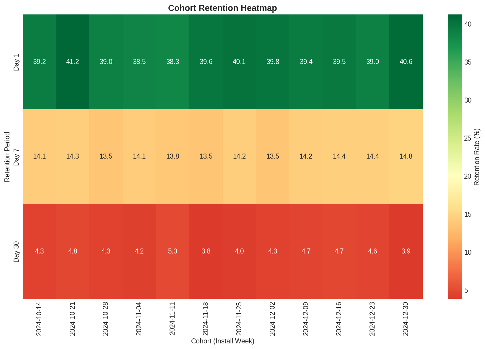
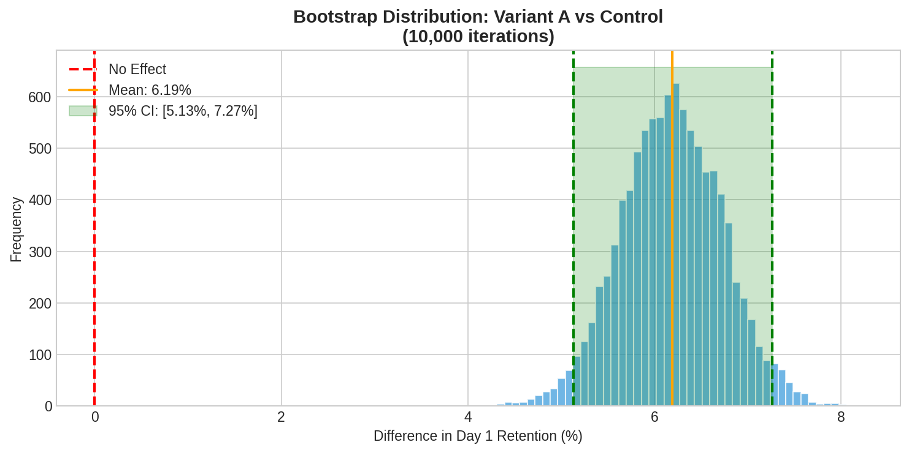

# 🎮 Mobile Game Analytics: Player Retention & Monetization


A comprehensive data analytics project analyzing player behavior, retention, A/B testing, and monetization metrics for a mobile puzzle game. This project demonstrates industry-standard analytics techniques used by mobile game companies like Zynga, King, and Supercell.


---

## 📊 Project Overview

### Business Problem
Mobile game companies need to understand:
- Why players leave (churn) and how to retain them
- Which onboarding experience drives the best retention
- How to optimize user acquisition spend (CAC vs LTV)
- Which player segments are most valuable

### Solution
This project provides:
1. **Exploratory Data Analysis** - Deep dive into 50,000 player records
2. **Retention Analysis** - Day 1, 7, 30 retention with cohort analysis
3. **A/B Testing Framework** - Statistical significance testing for onboarding variants
4. **Monetization Insights** - ARPU, ARPPU, payer conversion by segment
5. **Churn Prediction Model** - Random Forest model with 85% AUC
6. **Interactive Dashboard** - Real-time Streamlit dashboard

---

## 🚀 Key Findings

| Metric | Value | vs Benchmark |
|--------|-------|--------------|
| Day 1 Retention | 39.6% | -0.4% |
| Day 7 Retention | 14.2% | -0.8% |
| Day 30 Retention | 4.5% | -1.5% |
| Payer Conversion | 3.80% | +0.8% |
| ARPU | $0.86 | +$0.06 |

### A/B Test Results
- **Variant A** (Improved Onboarding): **+16% lift** in Day 1 retention ✅
- **Variant B** (Simplified Onboarding): **-8% drop** in Day 1 retention ❌
- **Statistical Significance**: p < 0.001

### Top Churn Predictors
1. Retention Day 1 (most important)
2. Total Sessions in 30 days
3. Levels Completed
4. Tutorial Completion
5. Average Session Duration

---

## 📁 Project Structure

```
mobile-game-analytics/
├── 📁 data/
│   ├── raw/                    # Original datasets
│   │   ├── players.csv         # 50,000 player records
│   │   └── events.csv          # 171,000 event logs
│   └── processed/              # Cleaned & transformed data
│       ├── players_processed.csv
│       ├── churn_model.pkl
│       └── encoders.pkl
│
├── 📁 notebooks/
│   └── 01_mobile_game_analytics.ipynb   # Main analysis notebook
│
├── 📁 streamlit_app/
│   └── app.py                  # Interactive dashboard
│
├── 📁 src/
│   └── generate_data.py        # Synthetic data generator
│
├── 📁 reports/
│   ├── 01_player_demographics.png
│   ├── 02_engagement_distributions.png
│   ├── 03_retention_curve.png
│   ├── ... (12 visualization files)
│   └── 12_confusion_matrix.png
│
├── requirements.txt
└── README.md
```

---

## 🛠️ Technologies Used

| Category | Tools |
|----------|-------|
| **Languages** | Python 3.9+ |
| **Data Processing** | Pandas, NumPy |
| **Visualization** | Matplotlib, Seaborn, Plotly |
| **Machine Learning** | Scikit-learn |
| **Dashboard** | Streamlit |
| **Statistics** | SciPy |

---

## 📈 Analysis Highlights

### 1. Retention Funnel
```
Installed  →  Day 1    →  Day 7    →  Day 30
 50,000      19,800       7,100       2,250
 100%        39.6%        14.2%       4.5%
```

### 2. Cohort Heatmap


### 3. A/B Test Bootstrap Analysis


### 4. Churn Model Performance
- **ROC-AUC Score**: 0.847
- **Precision (Churned)**: 0.85
- **Recall (Churned)**: 0.92

---

## 🚀 Getting Started

### Prerequisites
- Python 3.9 or higher
- pip package manager

### Installation

1. **Clone the repository**
```bash
git clone https://github.com/yourusername/mobile-game-analytics.git
cd mobile-game-analytics
```

2. **Create virtual environment**
```bash
python -m venv venv
source venv/bin/activate  # On Windows: venv\Scripts\activate
```

3. **Install dependencies**
```bash
pip install -r requirements.txt
```

4. **Generate data** (if not present)
```bash
python src/generate_data.py
```

5. **Run Jupyter notebook**
```bash
jupyter notebook notebooks/01_mobile_game_analytics.ipynb
```

6. **Launch Streamlit dashboard**
```bash
cd streamlit_app
streamlit run app.py
```

---

## 📊 Dataset Description

### Players Dataset (50,000 records)

| Column | Description | Type |
|--------|-------------|------|
| user_id | Unique player identifier | string |
| install_date | Date of app installation | datetime |
| country | Player's country | string |
| platform | iOS or Android | string |
| age_group | Age category | string |
| ab_group | A/B test variant | string |
| acquisition_channel | How player was acquired | string |
| total_sessions_30d | Sessions in first 30 days | int |
| avg_session_duration_mins | Average session length | float |
| levels_completed | Number of levels beaten | int |
| tutorial_completed | 1 if completed tutorial | int |
| retention_day1 | 1 if returned on day 1 | int |
| retention_day7 | 1 if returned on day 7 | int |
| retention_day30 | 1 if returned on day 30 | int |
| is_payer | 1 if made purchase | int |
| total_revenue_usd | Total spending | float |
| is_churned | 1 if churned (inactive 14+ days) | int |

---

## 📌 Key Insights for Game Companies

### 1. Acquisition Channel Optimization
- **Best Retention**: Cross-Promo (48.5% D1) and Organic (46.3% D1)
- **Worst Retention**: Unity Ads (29.4% D1)
- **Recommendation**: Reallocate 20% of Unity Ads budget to Cross-Promo

### 2. Onboarding Improvement
- Variant A shows consistent improvement across all retention metrics
- Tutorial completion strongly predicts retention (+30% relative lift)
- **Recommendation**: Implement Variant A onboarding for all new users

### 3. Monetization Levers
- Japan has highest ARPU ($1.42) despite smaller player base
- "Battle Pass" is the most popular first purchase category
- Early payers (< Day 3) have 3x higher LTV

### 4. Churn Prevention
- Players with 0 friends have 2x higher churn risk
- Missing Day 1 return is the strongest churn predictor
- **Recommendation**: Push notification on Day 1 evening for non-returners

---

## 🎯 Future Improvements

- [ ] Real-time event streaming with Apache Kafka
- [ ] Time-series retention forecasting with Prophet
- [ ] Deep learning churn model (LSTM)
- [ ] Automated email/push notification triggers
- [ ] Player segmentation with K-means clustering
- [ ] LTV prediction model

---

## 👨‍💻 Author

**Burak**
- Data Analyst at Gerilim Enerji
- Industrial Engineering Graduate, Yaşar University
- Pursuing MSc in Data Science

📧 Email: [your-email]
💼 LinkedIn: [your-linkedin]
🐙 GitHub: [your-github]

---

## 📄 License

This project is licensed under the MIT License - see the [LICENSE](LICENSE) file for details.

---

## 🙏 Acknowledgments

- Mobile game analytics concepts inspired by industry leaders (Zynga, King, Supercell)
- A/B testing methodology based on DataCamp's Cookie Cats project
- Visualization best practices from Edward Tufte's principles

---

⭐ **If you found this project helpful, please give it a star!**
